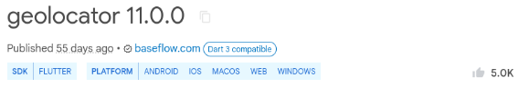
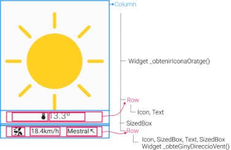


# Unitat 5. Construcción asíncrona de Widgets


Hoy en día, la gran mayoría de aplicaciones, y especialmente las aplicaciones móviles están fuertemente integradas en la nube, y hacen uso de múltiples servicios de Internet.

El trabajo con la nube implica que las aplicaciones deben estar preparadas para trabajar en entornos de naturaleza asíncrona, donde la respuesta a una petición no es inmediata. En esta unidad veremos uno de los widgets principales que hacen posible la construcción asíncrona de interfaces: **FutureBuilder**. 

---
# PENDIENTE
No lo vamos a ver de momento, pero tenéis, en el enlace de los apuntes en valenciano, el Widget **StreamBuilder** que nos permite trabajar con secuencias de eventos asíncronos.
--- 

[1.	El Widget FutureBuilder](#_apartado1)

[2.	Un ejemplo con FutureBuilder. Geolocalización.](#_apartado2)

[3.	Una app del tiempo](#_apartado3)


# <a name="_apartado1"></a>1. El Widget FutureBuilder

Hoy en día las aplicaciones, ya sean de escritorio, pero sobre todo móviles están fuertemente integradas en la nube, y hacen uso de múltiples servicios de Internet para diversos fines, como pueda ser la obtención de información o la gestión de la persistencia. El trabajo con la nube supone que las aplicaciones deben estar preparadas para trabajar en entornos de naturaleza asíncrona, donde la respuesta a una petición no es inmediata. 

De las aplicaciones actuales, se espera un comportamiento fluido, que no de la sensación de bloqueo, y que permitan la interacción mientras se está esperando alguna respuesta.

Es ahí donde entran en juego los widgets que hacen posible trabajar este asincronismo.

## Asincronismo en Dart: Futures

Hacemos un breve repaso sobre los *Futures* vistos en la unidad de Dart. La clase *Future* definía tipos de datos asociados a tareas asíncronas, que no se resolvían de forma inmediata, como una petición a la red o la lectura de un fichero.

A modo de ejemplo, propusimos la siguiente función:

```dart
Future<String> funcionAsincrona(){
 return Future.delayed(Duration(seconds: 1), (){
   print("Estamos en función Asíncrona");
   return 'Valor de retorno';
 });
}
```

Esta función devuelve un objeto de tipo *Future* que, al cabo de un segundo se *resuelve* en un String. Para ello se usa el método `Future.delayed`, que realiza ciertas acciones después de una pausa de la duración indicada.

Hay que remarcar que el tipo devuelto es un *Future*, de manera que hay que tratarlo de manera adecuada. Para ello teníamos dos opciones:

**Opción 1: Preparar un callback para cuando se resuelva el *Future***

Para prepararnos para cuando se resuelve el Future hacemos uso del método *then* de esta clase, de la siguiente manera:

```dart
Future<String> respuesta = funcionAsincrona();
respuesta.then((valorRespuesta) => print("Respuesta: $valorRespuesta"));
```

**Opción 2: Hacer síncrona la función asíncrona**

Para ello hacíamos uso de la combinación `async/await`, con el fin de esperarnos a que finalizara la función asíncrona y acceder directamente al resultado. Es decir, convertimos una función asíncrona en una síncrona:

nombreFuncion() async {
  String respuesta=await funcioAsincrona();
    print("Resposta: $respuesta");
}

## El Widget FutureBuilder

Cuando trabajamos con funciones asíncronas en Flutter, la interfaz de usuario debe responder de manera adecuada a los diferentes eventos y resultados, de manera que el comportamiento sea el esperado y no se produzcan bloqueos en la misma.

El widget `FutureBuilder` nos permite crear parte de la interfaz de manera asíncrona. Se trata de un widget con estado que puede generarse a sí mismo como respuesta a algún acontecimiento asíncrono.

Si hacemos uso del snippet **futureBld** veremos que este nos genera el siguiente código, en el que podemos apreciar las principales propiedades del widget:

```dart
FutureBuilder(
  future: Future,
  initialData: InitialData,
  builder: (BuildContext context, AsyncSnapshot snapshot) {
    return ;
  },
),
```

Este constructor del widget recibe tres argumentos con nombre:

- `future`: con el nombre del *Future* resultante de una operación asíncrona,
- `initialData`: con el valor inicial para el futuro hasta que se resuelva éste, 
- `builder`: Este es el único argumento requerido, y se trata de una función anónima que se invocará una vez se ha resuelto el Future con el fin de generar el widget. Esta función recibe el `context` y un objeto de tipo `AsyncSnapshot` con información sobre el estado del Future y su resultado si se ha completado. Este `snapshot` (*instantánea*) contendrá, entre otros, el flag `hasData` que informa sobre la resolución del Future y de la propiedad `data`, donde se encuentra el valor al que se ha resuelto el Future. En caso de que se haya producido algún error, también disponemos del flag `haserror` para indicarlo y la propiedad `error` con la descripción del mismo.

Vemos como haríamos uso de este widget para generar un widget para la interfaz de usuario como respuesta al resultado de la función asíncrona definida previamente:

```dart
class WidgetAsincrono extends StatelessWidget {
  const WidgetAsincrono({super.key});

  @override
  Widget build(BuildContext context) {
    return FutureBuilder(
      future: funcioAsincrona(),
      initialData: "Esperando respuesta...",
      builder: (BuildContext context, AsyncSnapshot snapshot) {
        String text = "";
        if (snapshot.hasData) text = snapshot.data.toString();
        return Text(text);
      },
    );
  }
}
```

Como vemos, hemos creado la clase `WidgetAsincrono`, nos construye un `FutureBuilder`. Este `FutureBuilder` depende de la función asíncrona `funcioAsincrona` definida previamente. Mientras ésta no se haya resuelto, el valor que contendrá `snapshot` será el que hemos asignado de manera predeterminada a `initialData`, de manera que inicialmente, el `builder` construirá el widget con este valor. Cuando el *Future* de la función asíncrona se resuelva, el valor del ***snapshot*** cambiará, cambiando el estado del FutureBuilder y forzando el redibujado del widget con el resultado. 

De esta manera, la aplicación mostrará el texto *"Esperando respuesta..."*, y al cabo de un tiempo éste cambiará a *"Valor de retorno"*, que es el que devolvía esta función.


Podemos ver el resultado completo en el siguiente Gist: 
[https://dartpad.dev/embed-flutter.html?id=8a37088f2339ad57bfa749ac120bec5a](https://dartpad.dev/embed-flutter.html?id=8a37088f2339ad57bfa749ac120bec5a)

<iframe
  src="https://dartpad.dev/embed-inline.html?id=8a37088f2339ad57bfa749ac120bec5a"
  width="100%"
  height="500px"
  frameborder="0">
</iframe>

### **Indicador de Progreso**

Si no deseamos mostrar un valor inicial mientras se está esperando respuesta, podemos hacer uso de indicadores de progreso, como puedan ser los lineares `CircularProgressIndicator` o `LinearProgressIndicator`. Veámoslo con algunos ejemplos.

Por ejemplo, un indicador de progreso circular:

```dart
return FutureBuilder(
  future: funcionAsincrona(),
  builder: (BuildContext context, AsyncSnapshot snapshot) {
    if (snapshot.hasData) {
      return Center(child: Text(snapshot.data.toString()));
    }
    return const CircularProgressIndicator();
  },
);
```

En este ejemplo, no utilizamos un valor inicial, pero mientras el ***snapshot*** no contenga datos, devolveremos el indicador de progreso.

Este indicador suele tener un tamaño relativamente pequeño, por lo que podemos utilizar un widget de tipo *SizedBox* para rodearlo:

```dart
return FutureBuilder(
  future: funcioAsincrona(),
  builder: (BuildContext context, AsyncSnapshot snapshot) {
    if (snapshot.hasData) {
      return Center(child: Text(snapshot.data.toString()));
    }
    return const Center(
      child: SizedBox(
        height: 200,
        width: 200,
        child: CircularProgressIndicator(),
      ),
    );
  },
);
```

El widget `LinearProgressIndicator` nos muestra un indicador de progreso lineal, en lugar de circular, y suele usarse en la parte superior del cuerpo, en lugar de centrado. Para ello, haríamos:

```dart
return FutureBuilder(
  future: funcioAsincrona(),
  builder: (BuildContext context, AsyncSnapshot snapshot) {
    if (snapshot.hasData) {
      return Center(child: Text(snapshot.data.toString()));
    }
    // Indicador de progreso lineal, que se muestra
    // en la parte superior del body
     return const LinearProgressIndicator();
  },
);
```


Podemos ver el resultado completo en el siguiente Gist: 
[https://dartpad.dev/embed-flutter.html?id=1e24c8784963912e6ce27c17b4a78942](https://dartpad.dev/embed-flutter.html?id=1e24c8784963912e6ce27c17b4a78942)

<iframe
  src="https://dartpad.dev/embed-inline.html?id=1e24c8784963912e6ce27c17b4a78942"
  width="100%"
  height="500px"
  frameborder="0">
</iframe>


### **ConnectionState**

El *Snapshot* que se nos devuelve contiene más información sobre la respuesta, como por ejemplo su estado. Este estado se representa mediante el enumerado `ConnectionState`, que puede tomar los siguientes valores:

- `none`: para indicar que la conexión aún no se ha iniciado, de manera que se usa `initialData`,
- `waiting`: para indicar que ha comenzado la operación asíncrona, y probablemente el contenido de los datos del *Snaphot* sean nulas.
- `active`: para indicar que el snaphot contiene datos válidos (no nulos), y probablemente cambiantes con el tiempo.
- `done`: para indicar que el *Snapshot* contiene datos y estos no son nulos.

Veamos de nuevo el ejemplo incluyendo la comprobación de este estado:

Este código nos mostrará el estado *ConnectionState.Waiting* hasta que se reciba la respuesta. Cuando tengamos la respuesta, mostraremos el estado *Done* y el resultado de la misma.

Si reemplazamos la obtención del future per `future:null` (la línea comentada y comentamos la línea `future:funcioAsincrona()`), veremos que el estado se nos muestra como `None`, ya que no iniciamos la conexión en ningún momento.

Podemos ver el resultado completo en el siguiente Gist: 
[https://dartpad.dev/embed-flutter.html?id=d1447b56b5c46d0ca2fabb45d964bf3f](https://dartpad.dev/embed-flutter.html?id=d1447b56b5c46d0ca2fabb45d964bf3f)

<iframe
  src="https://dartpad.dev/embed-inline.html?id=d1447b56b5c46d0ca2fabb45d964bf3f"
  width="100%"
  height="500px"
  frameborder="0">
</iframe>


# <a name="_apartado2"></a>2. Un ejemplo con FutureBuilder. Geolocalización.

La gran mayoría de recursos y servicios se ofrecen de forma asíncrona. En este apartado veremos, a modo de ejemplo la librería **geolocator**, que sirve para obtener la ubicación actual del dispositivo.

## La librería geolocator

El repositorio [pub.dev](https://pub.dev/) contiene todos los paquetes oficiales para Dart y Flutter. Existen varios plugins de este repositorio que nos permiten obtener la ubicación del dispositivo desde nuestro código. Uno de ellos es [el plugin *geolocator*](https://pub.dev/packages/geolocator).



El repositorio [pub.dev](https://pub.dev/) nos ofrece para cada paquete información diversa que es interesante conocer.

Tal y como podemos ver en la imagen de arriba, aparte del nombre del paquete y su versión, se nos muestra otra información que conviene tener en cuenta antes de utilizar un paquete:

---

- Nos muestra una etiqueta (Null Safety) si la librería está escrita con el sistema de tipo *null safety* de Dart (a partir de la versión 2.12 del lenguaje). Esto no significa que sus funciones retornen siempre valores no nulos, sino que, se indica explícitamente cuando una función puede devolver un tipo potencialmente nulo (¿con Tipo?). Por ejemplo, algunas funciones de esta librería pueden devolver un tipo null cuando no se es capaz de determinar la ubicación.
  
- Para que SDK está creada (Flutter),
- Para que plataformas es compatible (en este caso: Android, iOS, MacOS, Web y Windows). Para Linux, habría que incorporar también la librería [geolocator_linux](https://pub.dev/packages/geolocator_linux).

---

El paquete *Geolocator* nos proporciona acceso a la ubicación haciendo uso de los servicios de localización específicos de la plataforma. Por este motivo, deberemos realizar una configuración específica para habilitar los servicios de geolocalización.

### **Instalación**

Con el fin de instalar el paquete *Geolocator* lo añadimos como dependencia con la orden:

```
flutter pub add geolocator
```

Esto nos añadirá al fichero de configuración pubspec.yaml la dependencia:

```yaml
dependencies:
  ...
  geolocator: ^11.0.0
```

Recordad que los paquetes descargados no se almacenan en nuestro proyecto, sino en un recurso compartido por todos los proyectos en nuestra carpeta de usuario.

### **Configuración para Android**

Dado que el plugin `geolocator` es un paquete que contiene una implementación por plataforma, deberemos adaptar el proyecto específico de cada una de ellas. En la web del plugin en el repositorio tenemos los pasos a seguir para las diferentes plataformas soportadas de forma oficial.

En nuestro caso, adaptaremos el proyecto de Android, situado en la carpeta *android de* nuestro proyecto Flutter.

Los pasos a realizar para la adaptación son los siguientes: 

1. Comprobamos que el fichero *android/gradle.properties* está configurado para utilizar las librerías de Jetpack (AndroidX), añadiendo, si no existieran las siguientes líneas: 

```
android.useAndroidX=true
android.enableJetifier=true
```

2. Modificamos el fichero *android/app/src/main/AndroidManifest.xml* con el fin de indicar que la aplicación requerirá del usuario para que le otorgue permiso para acceder a los servicios de geolocalización. Para ello, incorporaremos como hijos directos de la etiqueta `manifest` las siguientes líneas:

```xml
<manifest xmlns:android="http://schemas.android.com/apk/res/android">

    <uses-permission android:name="android.permission.ACCESS_FINE_LOCATION" />
    <uses-permission android:name="android.permission.ACCESS_COARSE_LOCATION" />
    <!-- Per obtindre la ubicació en temps real encara que l'app estiga en segon pla -->
    <uses-permission android:name="android.permission.ACCESS_BACKGROUND_LOCATION" />


    <application ...
```

Android ofrece dos niveles de precisión para la ubicación: **aproximada**, con una estimación precisa en unos 3 kilómetros cuadrados, y **precisa**, con un margen de error de pocos metros. El permiso `ACCESS_COARSE_LOCATION` hace referencia a la ubicación aproximada, mientras que `ACCESS_FINE_LOCATION` hace referencia a la ubicación precisa.

Por otro lado, a partir de Android 10, es necesario incluir el permiso `ACCESS_BACKGROUND_LOCATION`, con el fin de recibir actualizaciones de la ubicación mientras la aplicación se está ejecutando en segundo plano.

## Utilización de la librería

Una vez tenemos la librería configurada en el proyecto ya podemos hacer uso de ella en nuestras aplicaciones. Para ello, lo primero que debemos hacer es importar la librería en nuestros ficheros *dart*, con la declaración `import` correspondiente, indicando el paquete y el fichero a importar:

```dart
import 'package:geolocator/geolocator.dart';
```

Una vez tenemos la librería importada, podemos utilizar la clase *Geolocator* para obtener información relativa a la geolocalización. 

Entre las diferentes funcionalidades que nos ofrece, encontramos:

- `Geolocator.isLocationServiceEnabled()`: Función asíncrona que indica si el servicio de geolocalización está activo.
  
- `Geolocator.checkPermission()`: Comprueba si se tienen permisos de acceso al servicio de geolocalización. Los permisos pueden ser: 
  - `LocationPermission.always`: El permiso está concedido incluso cuando la app está ejecutándose en segundo plano.
  
  - `LocationPermission.denied`: El permiso no está concedido, pero se puede pedir acceso al usuario.
  - `LocationPermission.deniedForever`: El permiso está denegado de manera persistente, de manera que no pide acceso al usuario. Si se desea modificar el permiso debe hacerse desde la configuración de la aplicación. 
  - `LocationPermission.unableToDetermine`: No se ha podido saber el estado de los permisos sobre geolocalización. Sólo será aplicable a entornos web.
- `Geolocator.requestPermission()`: Muestra el diálogo del sistema para pedir permiso al usuario sobre la geolocalización. 
- `Geolocator.getCurrentPosition()`: Devuelve de manera asíncrona la posición actual proporcionada por el servicio de geolocalización, con sus respectivas coordenadas de latitud y longitud.
- `Geolocator.getLastKnownPosition()`: Devuelve de manera asíncrona la última posición conocida almacenada en el dispositivo. Cuando no hay ninguna posición disponible, se devuelve *null*.

Finalmente, dado que el paquete contiene código específico de la plataforma, deberemos recompilar y reiniciar la aplicación, ya que un *hot reload* o *hot restart* solo afecta al código Dart.

Pasamos ahora a ver el código que nos implementa la funcionalidad para obtener la ubicación. Para ello, implementamos en el fichero `lib/services/geolocation_service.dart` la clase `GeolocationService`, que implementará el método `determinaPosicio()`. 

**La carpeta services**

Cuando nuestras aplicaciones hacen uso de servicios con cierta funcionalidad específica, es habitual crear una carpeta específica para ellos, llamada `services`. Ésta contiene clases con métodos que proporcionan características especializadas. Podemos encontrar servicios de acceso a API, de almacenamiento o de acceso a medios, por ejemplo. 

Los servicios nos ayudan a mantener un código relativamente limpio y separar funcionalidad, abstrayendo las funcionalidades obtenidas de fuentes de terceros, y reduciendo la dependencia.

En este caso, lo que hacemos es ofrecer un servicio de geolocalización que hace uso de la librería `geolocator`. Si en un futuro se cambiara de librería, sólo habría que modificar esta clase de servicio.

Pues bien, este método `determinaPosicion` de la clase `GeolocationService` hace uso de la librería `geolocator` y se encarga de comprobar y solicitar los permisos correspondientes al usuario. Observemos los comentarios al código para entender mejor su funcionamiento:

```dart
import 'package:geolocator/geolocator.dart';

class GeolocationService {
  static Future<Position?> determinaPosicion() async {

    //  Declaración de variables
    bool serviceEnabled;
    LocationPermission permission;

    // Comprobamos que el servicio de geolocalitazción esté en funcionamiento
    serviceEnabled = await Geolocator.isLocationServiceEnabled();

    if (!serviceEnabled) {
      // Si el servicio de geolocalitzación no está activo, devolvermos un error 
      // para informar al usuario. Para ello hacemos uso de Future.error
      return Future.error('El servicio de geolocalitzación está desactivado');
    }

    // En caso que el servicio esté en funcionamiento, comprobamos los permisos:
    permission = await Geolocator.checkPermission();

    // Si no tenemos permisos...
    if (permission == LocationPermission.denied) {
      // Pedimos permiso al usuiaro (observemos que utilizamos await
      // para esperar que el usuario conceda explícitamente el permiso)

      permission = await Geolocator.requestPermission();

      // Si el usuario no ha concedido el permiso...
      if (permission == LocationPermission.denied) {
        // Se devuelve un error indicando que no se tienen
        // permisos para obtenir la ubicación. La próxima vez
        // que se lance la aplicación se volverá a preguntar

        return Future.error(
            'No se tienen permisos para acceder a la ubicación');
      }
    }

    // Si los permisos se han denegados de forma permanente
    // lanzamos otro error:

    if (permission == LocationPermission.deniedForever) {
      return Future.error('''El acceso a la ubicación del dispositivopor parte de la 
  aplicación se ha dengado de manera persistente.\n Si queréis modificar 
  el permiso, podéis hacerlo desde la configuración de la aplicación''');
    }

    // Finalmente, si tenemos acceso a la geolocalitzación, la devolvemos:
    return await Geolocator.getCurrentPosition();
  }
}
```

Observemos que este método se declara como `static Future<Position?>`, lo que quiere decir que devuelve un tipo *Future* que se resolverá a un tipo *Position*. Este tipo `Position` está definido también en la librería *geolocator*, y representa una posición con su latitud y longitud.

Sin embargo, lo que nos interesa es cómo tratar este *Future* que se nos devuelve y cómo dibujar el widget correspondiente. Para ello haremos uso de un widget *FutureBuilder* que dependerá de este *Future* para redibujarse.

Este widget se define en el fichero `lib/widgets/mostrar_coordenadas.dart` tendrá la siguiente estructura:

```dart
class WidgetMuestraCoordenadas extends StatelessWidget {
  const WidgetMuestraCoordenadas({super.key});

  @override
  Widget build(BuildContext context) {
    return FutureBuilder(
      future: GeolocationService.determinaPosicion(),
      builder: (BuildContext context, AsyncSnapshot snapshot) {
        // ...
        // Codigo de construcción del widget
        // ...
      },
    );
  }
}
```

Como vemos, el método `build` de este widget para mostrar las coordenadas crea un *FutureBuilder* que depende del resultado del método `GeolocationService.determinaPosicion()`.

**Abriendo Google Maps**

Para abrir Google Maps desde nuestra aplicación, haremos uso del complemento [*maps_launcher*](https://pub.dev/packages/maps_launcher). Para ello, al proyecto hemos añadido éste con:

```
flutter pub add maps_launcher
```

Y después, importarlo al fichero correspondiente con:

```
import 'package:maps_launcher/maps_launcher.dart';
```

Una vez importado, podremos hacer uso del método `MapsLauncher.launchCoordinates(latitud, longitud)`, que nos abre la aplicación de Google Maps con la ubicación correspondiente.

Veamos ahora cuál es el contenido del componente `builder` de este widget:

```dart
builder: (BuildContext context, AsyncSnapshot snapshot) {
  String text = "";
  double latitud = 0.0;
  double longitud = 0.0;

  // Cuando el estado de la petición al servicio indica que ha finalizado
  if (snapshot.connectionState == ConnectionState.done) {
    // Comprobamos si tiene errores
    if (snapshot.hasError) {
      debugPrint(snapshot.error.toString());
      text = "Error: ${snapshot.error.toString()}";
    } else if (snapshot.hasData) {
      // O si contiene datos. En este caso la longitud y la latitud
      // y el texto para mostrarlas:
      latitud = snapshot.data.latitude ?? 0.0;
      longitud = snapshot.data.longitude ?? 0.0;
      text = "Ubicación actual: ($latitud, $longitud)";
    }

    // Y creamos el widget, que mostrará centrado este texto
    // y un botón para abrir Google Maps.

    return Center(
      child: Column(
        mainAxisAlignment: MainAxisAlignment.center,
        children: [
          Text(text),
          ElevatedButton(
              onPressed: () async {
                try {
                  await MapsLauncher.launchCoordinates(latitud, longitud);
                } catch (err) {
                  ScaffoldMessenger.of(context).showSnackBar(
                    const SnackBar(
                      content:
                          Text("No se ha encontrado una aplicación de mapas"),
                    ),
                  );
                }
              },
              child: const Text("Abre la ubicación"))
        ],
      ),
    );
  } else {
    // Mientras no finalice la petición al servicio, muestra
    // el indicador de progreso

    return const Center(
      child: SizedBox(
        width: 200,
        height: 200,
        child: CircularProgressIndicator(),
      ),
    );
  }
},
```

Como vemos, en primer lugar, se hacen varias comprobaciones sobre la respuesta de la función asíncrona mediante el `snapshot` que recibimos como argumento. Con `snapshot.connectionState` comprobamos el estado de la respuesta. Cuando este es `ConnectionState.done` significa que ya hemos obtenido la respuesta, de manera que comprobamos si se ha producido algún error (con `snapshot.hasError`), y si este `snapshot` contiene datos. En caso de que contenga información, se construye el mensaje para mostrar a partir de esta información y se devuelve en un widget de tipo Texto centrado. Mientras se esté esperando respuesta, lo que se dibujará es un indicador de progreso circular.


# <a name="_apartado3"></a>3. Una app del tiempo

En este apartado vamos a ver cómo podríamos hacer una aplicación que nos proporcione información sobre el tiempo en la ubicación del dispositivo.

Para ello haremos uso de contenidos que ya hemos tratado y los haremos trabajar de manera conjunta, como la **geolocalización**, las **conexiones** a servicios web y la gestión de los ***Future***.

Para obtener la información meteorológica utilizaremos la API de *OpenMeteo*, un servicio web que nos proporciona esta información a partir de unas coordenadas geográficas. 

El funcionamiento de la aplicación será sencillo. En primer lugar, determinamos la ubicación del dispositivo y la proporcionaremos al widget que construye la interfaz, que hará uso de la API de OpenMeteo para obtener la información meteorológica. En el momento que recibamos esta información, construiremos el widget que la muestra.

## Creación y configuración del proyecto

En primer lugar, creamos el proyecto, y añadimos las librerías que necesitamos: *geolocator* y *http*:

```
flutter pub add http geolocator
```

A continuación, configuramos el *Geolocator* para Android:

1. Comprobamos que el fichero *android/gradle.properties* contiene las siguientes líneas:

```kotlin
android.useAndroidX=true
android.enableJetifier=true
```

2. Modificamos el fichero *android/app/src/main/AndroidManifest.xml* para configurar los permisos necesarios:

```xml
<manifest xmlns:android="http://schemas.android.com/apk/res/android">

    <uses-permission android:name="android.permission.ACCESS_FINE_LOCATION" />
    <uses-permission android:name="android.permission.ACCESS_COARSE_LOCATION" />
    <uses-permission android:name="android.permission.ACCESS_BACKGROUND_LOCATION" />

    <application ...
```


## Función para obtener la posición

El primer código que vamos a generar será una función para obtener la posición del dispositivo. Para ello, crearemos el fichero `lib/services/geolocation_service.dart`, con la clase `GeolocationService` y el método estático `determinaPosicion()`, que será una adaptación del método con el mismo nombre que hemos trabajado en el apartado anterior, y que hace uso de la librería *geolocator* para obtener las coordenadas GPS actuales. Esta función nos devolverá ya un Position con la latitud y la longitud.

```dart
import 'package:geolocator/geolocator.dart';

class GeolocationService {
  static Future<dynamic?> determinaPosicion() async {

    ...
    // Código para comprobar el servicio de geolocalización y los permisos 
    ...

    // Finalmente, si tenemos acceso a la geolocalitzación, la devolvemos:
    Position pos = await Geolocator.getCurrentPosition();

    return Map.from({"latitud": pos.latitude, "longitud": pos.longitude});
 }
}
```

## Obtención del tiempo

La API de *OpenMeteo*, como hemos comentado nos proporciona información meteorológica de un lugar concreto a partir de sus coordenadas geográficas. Un aspecto interesante de este servicio es que, a diferencia de la mayoría, no requiere ninguna clave ni registro previo para utilizarlo.

La API puede atender a varios formatos de URL. Pero la que nos interesa tiene una forma parecida a ésta:

```
https://api.open-meteo.com/v1/forecast?latitude=38.9675925&longitude=-0.1803423&current_weather=true
```

Como vemos, la API se encuentra en la dirección `https://api.open-meteo.com/v1/`, y concretamente, accedimos al recurso `forecast`, proporcionándole la latitud, la longitud, un parámetro current_weather, para indicar que lo que queremos es el tiempo actual.

Podéis probar a copiar esta dirección en un navegador web, para ver cómo es la respuesta. Ésta tendrá la forma:

```xml
{
   "latitude":38.97,
   "longitude":-0.1800003,
   "generationtime_ms":0.558018684387207,
   "utc_offset_seconds":0,
   "timezone":"GMT",
   "timezone_abbreviation":"GMT",
   "elevation":29.0,
   "current_weather":{
      "temperature":6.2,
      "windspeed":9.9,
      "winddirection":280.0,
      "weathercode":51,
      "time":"2023-01-29T09:00"
   }
}
```
Lo que nos interesará son los datos que se encuentran en `current_weather`: temperatura, velocidad del viento, dirección del viento y código del tiempo.

Para obtener esta información, crearemos un nuevo servicio. Concretamente la clase `WeatherService`, en el fichero `lib/services/weather_service.dart`. Esta clase implementará el método estático `obtenerClima` que realiza la petición correspondiente al servicio y devuelve esta información en forma de Future (`Future<dynamic>`).

```dart
import 'dart:io';
import 'dart:convert'; // Para realizar conversiones entre tipos de datos
import 'package:http/http.dart' as http; // Para realizar peticiones HTTP

class WeatherService {
  static Future<dynamic> obtenerClima(
      {required double longitud, required double latitud}) async {
    String url =
        'https://api.open-meteo.com/v1/forecast?latitude=$latitud&longitude=$longitud&current_weather=true';

    // Lanzamos una petición GET mediante el método http.get, y esperamos a la respuesta
    http.Response response = await http.get(Uri.parse(url));

    if (response.statusCode == HttpStatus.ok) {
      // Descodificamos la respuesta
      String body = utf8.decode(response.bodyBytes);
      final result = jsonDecode(body);

      // Y la devolvemos
      return result;
    } else {
      // Si no carga, lanzamos una excepción
      throw Exception('No se ha podido conectar');
    }
  }
}

```

Este código, como vemos, mantiene la estructura del código que utilizamos en la segunda unidad para realizar peticiones HTTP en APIs REST.

## La pantalla principal

La pantalla principal de la aplicación será un widget sin estado que llamaremos `OratgeScreen`, ubicada en `lib/screens/oratge_screen.dart`.

Esta pantalla se generará en términos de un tipo *Future*, que vendrá determinado por la ubicación del dispositivo:

```dart
class OratgeScreen extends StatelessWidget {
  const OratgeScreen({super.key});

  @override
  Widget build(BuildContext context) {
    return FutureBuilder(
        // Nuestro widget principal dependerá en primera instancia
        // de la ubicación
        future: GeolocationService.determinaPosicion(),
        builder: (BuildContext context, AsyncSnapshot snapshot) {
          //...
        });
    }
}
```

Como vemos, se trata de un `FutureBuilder*, cuyo `future` es el resultado de la función `determinaPosicion`.

El `builder` correspondiente dibujará un indicador de progreso mientras no se resuelva este *futuro*, y cuando se resuelva, si todo va bien nos devolverá un widget personalizado de tipo *WidgetClima* que definiremos en el apartado siguiente. En caso de producirse algún error, se generará un texto indicándolo.

```dart
builder: (BuildContext context, AsyncSnapshot snapshot) {
  // Inicialización de widget con el resultado
  Widget miTiempo;

  // Comprobamos el estado de la conexión
  if (snapshot.connectionState == ConnectionState.done) {
    // Si ha finalizado (ConnectionState.done), comprobamos si tiene errores
    if (snapshot.hasError) {
      // Si tiene errores, creeamos un un Text con el texto de este error
      debugPrint(snapshot.error.toString());
      miTiempo = Center(
        child: Text("Error: ${snapshot.error.toString()}"),
      );
    } else if (snapshot.hasData) {
      // Si no hay errores comprobamos si hay datos, y
      // construimos con ellos el widget a mostrar.
      // Recordemos que snapshot.data contendrá el contenido
      // que ha resuelto la llamada asíncrona.
      // Si todo va bien, el resultado será un Map (JSON),
      // con la latitud i la longitud

      double longitud = snapshot.data["longitud"];
      double latitud = snapshot.data["latitud"];

      miTiempo = Center(
        child: Padding(
          padding: const EdgeInsets.all(24.0),
          child: Column(children: [
            Text("Coordenades: $latitud, $longitud",
                style: Theme.of(context).textTheme.headlineMedium),
            const SizedBox(height: 50),
            WidgetClima(
              latitud: latitud,
              longitud: longitud,
            )
          ]),
        ),
      );
      // Finalmente, devolvemos el widget que hemos construido
      return miTiempo;
    }
  }

  return const LinearProgressIndicator();
}

```

Observemos algunos detalles:

- Cuando el resultado de la función `determinaPosicion()` se resuelve, obtendremos en el `snapshot` un diccionario con la latitud y la longitud, que serán los parámetros con los que habrá que inicializar nuestro widget personalizado `WidgetClima`.
  
- El widget que se construye cuando se resuelve este futuro es una columna (`Column`), centrada (`Center`) y con 24 puntos de margen (`Padding`), con `EdgeInsets.all(24.0))`. Esta columna contendrá dos filas: la primera con un texto con las coordenadas, a modo de cabecera, y la segunda, el widget personalizado `WidgetClima`.

---
Existen varios servicios web de geocodificación (OpenCage Geocoder, Geonames, Google Places, Mapbox), con los que podríamos obtener el nombre de la población a partir de las coordenadas geográficas, para mostrar éste en lugar de las coordenadas. No obstante, se trata de servicios que requieren de registro previo y autenticación, aunque se utilice un plan gratuito.
***

## El widget WidgetClima

Finalmente, el widget que mostrará la información meteorológica actual será el widget personalizado `WidgetClima`. Aunque podría tratarse de un widget sin estado, vamos a trabajarlo con estado.

Este widget tendrá la siguiente estructura:

```dart
class WidgetClima extends StatefulWidget {
  const WidgetClima({
    required this.latitud,
    required this.longitud,
    super.key,
  }); 

  final double? latitud;
  final double? longitud;

  @override
  State<WidgetClima> createState() => _WidgetClimaState();
}
```

Como vemos, es un widget que se inicializa con la latitud y la longitud, que se proporcionan como argumentos con nombre, y que contiene un estado `_WidgetClimaState`.

Este estado se definirá de la siguiente forma:

```dart
class _WidgetClimaState extends State<WidgetClima> {
  late Future<dynamic> info;

  @override
  void initState() {
    super.initState();
    info = WeatherService.obtenerClima(
        longitud: widget.longitud ?? 0.0, latitud: widget.latitud ?? 0.0);
  }

  @override
  Widget build(BuildContext context) {
    return FutureBuilder(
      future: info,
      builder: (BuildContext context, AsyncSnapshot snapshot) {
        //...
      },
    );
  }

  Widget _obtenerWidgetDireccionViento(double direccionViento) {...}

  Widget _obtenerIconoTiempo(String value) {...}
}
```

Este estado define la propiedad `info`, como un `Future` que se resolverá a un objeto `dynamic`, y que será el resultado del método `obtenerClima`, definido en la clase `WeatherService`.

Observemos que esta propiedad se ha definido como `late`. Esto se hace para indicar que el valor de una variable que requiere de inicialización se realizará posteriormente. En caso de que no hagamos esta inicialización posterior, el sistema lanzará la excepción ***LateInitializationError***. Por otra parte, esta inicialización se hace en el método `initState()`, de inicialización del estado.

Después, el método `build`, consistirá en un ***FutureBuilder*** que depende de esta propiedad `info`. Vemos que se han definido también un par de métodos privados: `_obtenerWidgetDireccionViento` y `_obtenerIconoTiempo`, que servirán para obtener algunas partes del widget del tiempo resultante.

Veamos ahora cómo se construye el widget en este componente `builder`. El esquema general del mismo será el siguiente:

```dart
builder: (BuildContext context, AsyncSnapshot snapshot) {
if (snapshot.hasData) {
     // Una vez se resuelve el Future, tendremos disponible
    // la información necesaria para construir el widget

    // Obtenemos, en primer lugar, la información del snapshot

    String temperatura =
        snapshot.data["current_weather"]["temperature"].toString();
    String velViento =
        snapshot.data["current_weather"]["windspeed"].toString();
    String direccionViento =
        snapshot.data["current_weather"]["winddirection"].toString();
    String codigo =
        snapshot.data["current_weather"]["weathercode"].toString();

    // Y ahora cremaos el widget

    return Column(...);
}
return const CircularProgressIndicator();
},
```

Como vemos, mientras el ***future*** no se haya resuelto y no contenga datos, se mostrará un indicador de progreso circular, y en el momento en que el `snapshot` tenga datos, se construirá el wiget. Estos datos que necesitaremos son la temperatura, la velocidad del viento, la dirección y un código que describe el clima (soleado, nube, etc.).

Este widget tendrá forma de columna, y esquemáticamente, tendrá el siguiente aspecto:



Como vemos, la columna tiene cuatro filas: Una con el icono descriptivo (sol, nubes), un `SizedBox`, una con la temperatura y otra con el viento.

Al mismo tiempo, las filas de la temperatura y la información del viento están compuestas por varias columnas, con iconos y texto. 

El código completo de esta columna será:

```dart
return Column(
children: [
    _obtenerIconoTiempo(codigo),
    Row(
    mainAxisAlignment: MainAxisAlignment.center,
    children: [
        const Icon(
        Icons.thermostat,
        size: 35,
        ),
        Text(
        "$temperaturaº",
        style: Theme.of(context).textTheme.headlineMedium,
        ),
    ],
    ),
    const SizedBox(height: 20),
    Row(
    mainAxisAlignment: MainAxisAlignment.center,
    children: [
        const Icon(Icons.wind_power, size: 35),
        const SizedBox(width: 30),
        Text(
        "${velViento}km/h",
        style: Theme.of(context).textTheme.headlineSmall,
        ),
        const SizedBox(width: 30),
        _obtenerWidgetDireccionViento(double.parse(direccionViento)),
    ],
    ),
],
);
```

Sólo nos queda por ver qué contienen los métodos privados `_obtenerIconoTiempo()` y `_obtenerWidgetDireccionViento()`.

### **El método _obtenerIconoTiempo()**

Este método devuelve un widget con una imagen que se corresponde al código del tiempo (Soleado, nube, etc.) Los códigos del tiempo están estandarizados por la Organización meteorológica mundial (WMO - Wolrd Meteorological Organization), y los podemos consultar en la web de OpenMeteo: <https://open-meteo.com/en/docs/dwd-api#weathervariables>-

Como podemos ver, para ello se definen varios conjuntos de códigos, y se hace uso del método `contains` de la clase `Set` para determinar a qué conjunto pertenece el código proporcionado, y por lo tanto saber qué imagen se corresponde. Las imágenes estarán definidas como ***assets*** en el fichero *pubspec.yaml*, y se encuentran en la carpeta `assets/icons/png`. 

Veamos el código completo:

```dart
  Widget _obtenerIconoTiempo(String value) {
    Set<String> sol = <String>{"0"};
    Set<String> pocasNubes = <String>{"1", "2", "3"};
    Set<String> nubes = <String>{"45", "48"};
    Set<String> lluviaSuave = <String>{"51", "53", "55"};
    Set<String> lluvia = <String>{
      "61",
      "63",
      "65",
      "66",
      "67",
      "80",
      "81",
      "82",
      "95",
      "96",
      "99"
    };
    Set<String> neu = <String>{"71", "73", "75", "77", "85", "86"};

    if (sol.contains(value)) {
      return Image.asset("assets/icons/png/soleado.png");
    }
    if (pocasNubes.contains(value)) {
      return Image.asset("assets/icons/png/poco_nublado.png");
    }
    if (nubes.contains(value)) {
      return Image.asset("assets/icons/png/nublado.png");
    }
    if (lluviaSuave.contains(value)) {
      return Image.asset("assets/icons/png/lluvia_debil.png");
    }
    if (lluvia.contains(value)) {
      return Image.asset("assets/icons/png/lluvia.png");
    }
    if (neu.contains(value)) {
      return Image.asset("assets/icons/png/nieve.png");
    }

    return Image.asset("assets/icons/png/poco_nublado.png");
  }

```

### **El método _obtenerWidgetDireccionViento()**

Este método nos devuelve una fila (`Row`) con dos elementos: Un texto con el nombre del viento y un icono que marca esta dirección. 

El método recibe un valor en coma flotante con la dirección del viento, expresada en grados, de manera que sólo debemos determinar en qué rango se encuentra esta dirección para establecer el icono y el nombre del viento correspondiente:

```dart
  Widget _obtenerWidgetDireccionViento(String direccionViento) {
    // Esta función nos devuelve un widget que contiene
    // un icono y un texto, con la dirección y el nombre del viento
    // segun su dirección.
    // Utilizamos `late` para indicar que asignaremos el valor después
    // a las variables.

    double dir = double.parse(direccionViento);
    late Icon icono;
    late String nombreViento;

    if (dir > 22.5 && dir < 65.5) {
      icono = const Icon(Icons.north_east);
      nombreViento = "Gregal";
    } else if (dir > 67.5 && dir < 112.5) {
      icono = const Icon(Icons.east);
      nombreViento = "Llevant";
    } else if (dir > 112.5 && dir < 157.5) {
      icono = const Icon(Icons.south_east);
      nombreViento = "Xaloc";
    } else if (dir > 157.5 && dir < 202.5) {
      icono = const Icon(Icons.south);
      nombreViento = "Migjorn";
    } else if (dir > 202.5 && dir < 247.5) {
      icono = const Icon(Icons.south_west);
      nombreViento = "Llebeig/Garbí";
    } else if (dir > 247.5 && dir < 292.5) {
      icono = const Icon(Icons.west);
      nombreViento = "Ponent";
    } else if (dir > 292.5 && dir < 337.5) {
      icono = const Icon(Icons.north_west);
      nombreViento = "Mestral";
    } else {
      icono = const Icon(Icons.north);
      nombreViento = "Tramuntana";
    }
    return Row(children: [
      Text(
        nombreViento,
        style: Theme.of(context).textTheme.headlineSmall,
      ),
      icono,
    ]);
  }
```


# FALTA STREAMS